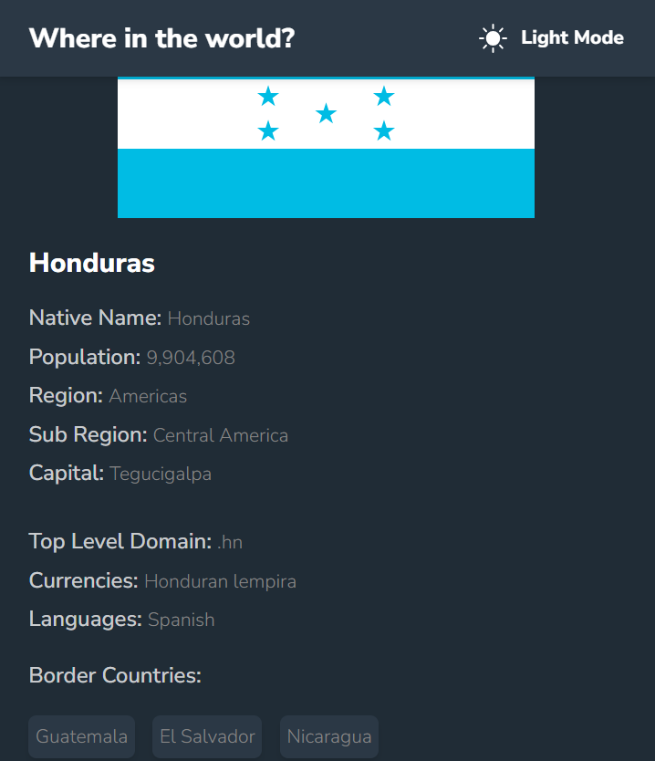

# REST Countries API Flag


## Overview

The REST Countries API Flag project is a web application that provides a comprehensive collection of flags from around the world. Users can filter flags by region and perform precise searches using a search bar. Clicking on a flag redirects you to a dedicated page with more details about the country.

This project was created with Vite, React, and Tailwind CSS, making it a modern and responsive web application.

## Features

- Browse a vast collection of flags from countries worldwide.
- Filter flags by region to narrow down your search.
- Use the search bar for precise country flag searches.
- Access detailed country information by clicking on a flag.
- **Dark and Light Themes:** Enjoy the flexibility of switching between dark and light themes to suit your preferences.

## Demo

You can access the live demo of the REST Countries API Flag project by clicking the following link: [REST Countries API Flag Demo](https://challenge-frontend-mentor-sand.vercel.app/)

## Screenshots




## Installation

To run this project locally, follow these steps:

1. Clone the repository to your local machine:

   ```bash
   git clone https://github.com/Snaper014/challenge-frontend-mentor.git

2. Navigate to the project directory:
    ```bash
    cd FrontEndMentor_RESTCountries

3. Install the project dependencies using npm:
    ```bash
    npm install
4. Start the development server:
    ```bash
    npm run dev
5. Open your web browser and access the project at http://localhost:3000.

## Usage

- Browse flags: Explore the flags of different countries by scrolling through the home page.
- Filter by region: Use the region filter to narrow down flags by continent.
- Search flags: Enter a country name in the search bar to find a specific flag.
- View country details: Click on a flag to access more information about the country.
- Switch Themes: Toggle between dark and light themes using the theme switcher.

## Technologies Used

- Vite: Fast and opinionated development tool.
- React: JavaScript library for building user interfaces.
- Tailwind CSS: Utility-first CSS framework.

